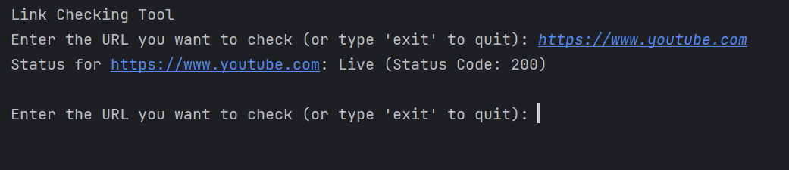

# LinkStatusChecker - Python Tool for Checking Live and Dead Links


LinkStatusChecker is a Python-based tool that allows users to check the status of URLs (links) to determine whether they are live (active) or dead (not working). The tool utilizes the `requests` library to send HTTP HEAD requests to the provided URLs and inspects the corresponding status codes to determine the link's status.



## Features

- User-friendly CLI interface for inputting URLs to be checked.
- Real-time status feedback indicating whether the link is live or dead.
- Display of HTTP status codes for live links to provide more detailed information.
- Graceful error handling to handle exceptions that may occur during the link checking process.

## Installation

Clone the Repository:

   ```
   git clone https://github.com/your_username/LinkStatusChecker.git
```
Install Dependencies:
```
cd LinkStatusChecker

pip install -r requirements.txt
```
Run the Tool:
```
python link_status_checker.py

```
The tool will prompt you to enter the URL you want to check. Type "exit" to quit the tool.

## Functions Used
`check_link_status(url):` This function checks the status of a given URL. It sends an HTTP HEAD request to the URL using the requests.head(url) method and inspects the response status code. It handles potential exceptions like requests.ConnectionError, requests.Timeout, and requests.RequestException to provide accurate feedback on the link's status.

`main():` The main() function serves as the entry point of the script. It interacts with the user, allowing them to input URLs for checking. It calls the check_link_status() function to obtain the status of each URL and displays the results in real-time.

`Exception Handling:` The script uses try-except blocks to handle potential errors gracefully. It catches various exceptions that may occur during the link checking process, such as connection errors or timeouts, and provides meaningful error messages.

`if __name__ == "__main__"::` This conditional statement ensures that the main() function is only executed when the script is run as the main module and not when imported as a module into another script.

## Contribution Guidelines

Contributions to the LinkStatusChecker project are welcome! If you want to contribute, please follow these steps:

### Fork the repository.

* Create a new branch for your feature or bug fix.
* Make your changes and commit them with descriptive commit messages.
* Push your changes to your fork.
* Create a pull request from your branch to the main repository.

## License
This project is licensed under the MIT License - see the LICENSE file for details.

## Disclaimer

It's essential to use the LinkStatusChecker tool responsibly and ensure that you have proper authorization to check the links you enter. Respect the terms and conditions of the websites you are checking, and do not use the tool for malicious purposes or against any platform's policies. Always obtain consent before checking links that belong to others.

## Contact

For inquiries or feedback, please contact

[](https://www.instagram.com/piyush.mujmule)
